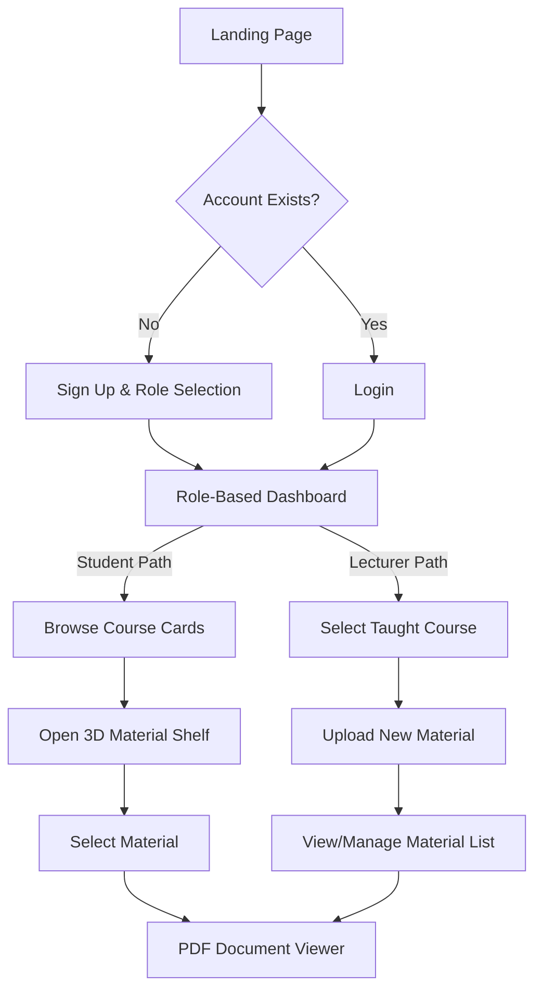

# Calabash (Knowledge) – Project Scope & Implementation Strategy

## 1. Executive Summary & Research Objectives

**Calabash (Knowledge)** is a high-performance, university-centric digital ecosystem designed to bridge the gap between traditional academic archives and the modern, always-on learning environment.

### Strategic Objectives (Research-Backed)

Based on current benchmarks for modern university digital libraries, Calabash aims to achieve:

- **Ubiquitous Accessibility**: 24/7 global access across heterogeneous devices, supporting asynchronous learning.

- **Cognitive Load Reduction**: Utilizing a clean, "Simplicity-First" UI and 3D visualization (Material Shelf) to make content discovery non-linear and engaging.
- **Knowledge Preservation**: Serving as a durable digital vessel for faculty intellectual property and rare academic archives.
- **Ecosystem Integration**: Built with a modular architecture to eventually integrate with Learning Management Systems (LMS) and Student Information Systems (SIS).

## 2. Expanded Project Scope

Calabash is not just a repository; it is a **Knowledge Management System (KMS)**.

### Core Pillars

- **Discovery Engine**: Advanced search and filtering based on metadata (Course, Semester, Faculty).
- **Content Lifecycle Management**: Role-based workflows for material submission, validation (Lecturers), and consumption (Students).
- **Visual Intelligence**: Interactive 3D visualization of the library (The Calabash Shelf) to provide a spatial mental model of academic materials.
- **Robust Rendering**: A high-fidelity PDF/Document interaction engine for deep-reading sessions.

## 3. Robust System Architecture (Design Specification)

### Frontend Layer (Current Focus)

- **Engine**: Next.js 15+ with App Router.
- **State**: Zustand for atomic, performant client-side state.
- **Visualization**: React Three Fiber (R3F) for the 3D Knowledge Vessel.
- **Interoperability**: Clean **Service Interface Layer** (src/services) to isolate the UI from data fetching logic.

### Proposed Backend Layer (Future-Proofing)

- **Scalable API**: A REST/GraphQL API designed around **Microservices** for independent scaling of the Search, Upload, and User Management services.
- **Storage Strategy**: Dedicated object storage (e.g., S3/Supabase Storage) for heavy PDF assets with CDN caching at the edge.
- **Database**: PostgreSQL with full-text search capabilities (pg_trgm) for rapid material discovery.
- **Security**: OAuth2/OIDC integration for university-wide Single Sign-On (SSO).

## 4. User Personas

### Persona A: The Aspiring Scholar (Student)

- **Name**: David, 3rd Year Engineering Student
- **Pain Points**: Overwhelmed by fragmented material (WhatsApp groups, emails). Struggles to find past questions during exam week. Finds traditional library portals "boring" and non-intuitive.
- **Goals**: Quickly locate the latest lecture slides, practice with verified past questions, and have a "visual home" for his academic resources.
- **Calabash Value**: David uses the **3D Material Shelf** to quickly browse through his semester's courses, finding what he needs in seconds rather than scrolling through endless folders.

### Persona B: The Knowledge Custodian (Lecturer)

- **Name**: Dr. Amina, Senior Lecturer in Computer Science
- **Pain Points**: Difficulty ensuring all students have the correct version of lecture notes. Worries about her intellectual property getting lost in unsecured links. No way to see if students are actually engaging with the material.
- **Goals**: Securely upload and organize materials by semester, provide a "single source of truth" for her students, and maintain a professional digital archive of her teaching career.
- **Calabash Value**: Dr. Amina uses the **Lecturer Dashboard** to batch-upload materials at the start of the semester, knowing they are safely categorized and easily accessible to her registered students.

## 5. High-Level User Flow

The following flow illustrates the core journey from landing to content consumption:

## 6. Design Principles (Global Minimalism)

Calabash utilizes a **Global Minimalism** approach to evoke a sense of focused academic excellence and institutional reliability:

- **Pure White Background**: Reduces visual noise and emphasizes content hierarchy.
- **Google Sans Variable**: A premium, modern typeface that balances readability with a sophisticated brand identity.
- **Vibrant Earth Accents**: Strategically used (Sienna, Sage, Amber Gold) for high-impact visual cues and grounded stability.

## 7. Implementation Roadmap

- **Phase 1: Foundation (COMPLETED)**: Project skeleton, Design System (Tailwind v4 + Custom Core UI), and dependencies.
- **Phase 2: Core UX & Mock Services (COMPLETED)**: Layouts, role-based dashboards, and the API contract layer.
- **Phase 3: Visual & PDF Intelligence (COMPLETED)**: 3D Shelf implementation and high-fidelity document viewer.
- **Phase 4: Robustness & Refinement (COMPLETED)**: CI/CD optimization, linter hardening, and typography upgrade.

## 7. Success Metrics

- **Discoverability**: Ability to reach any course material in < 3 clicks.
- **Engagement**: Usage of the 3D Shelf for non-linear exploration.
- **Stability**: Clean build and type-safety across all service interfaces.
